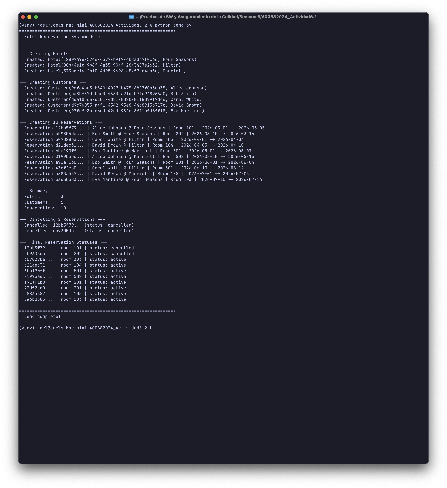
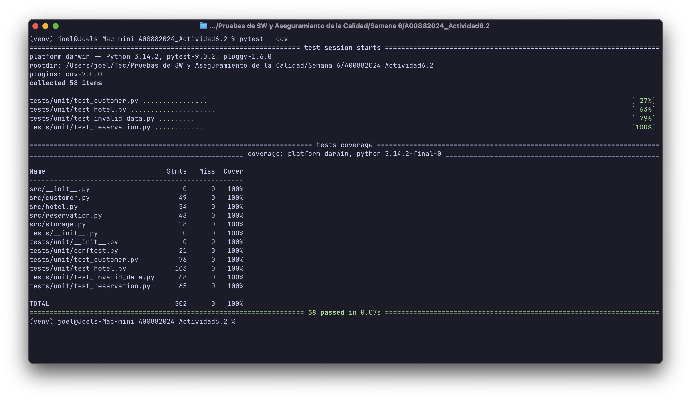
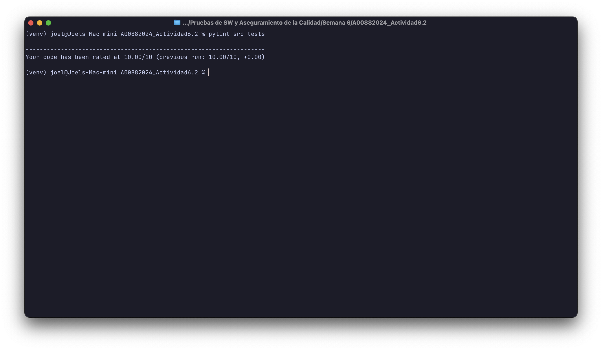
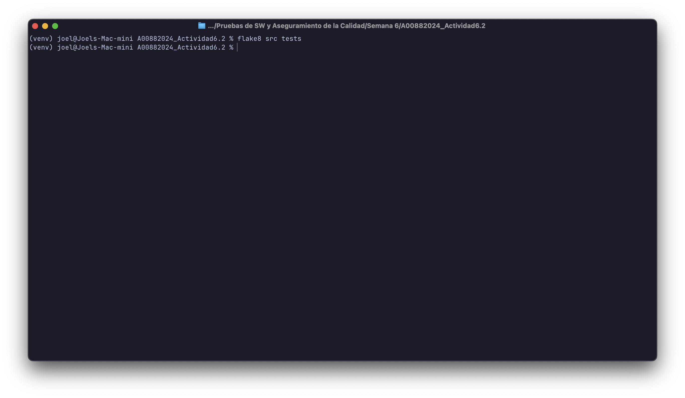

# Pruebas de SW y Aseguramiento de la Calidad

## Actividad 6.2: Ejercicio de programación 3

**Student:** Joel Garcia Martinez
**Student ID:** A00882024

---

## Project Structure

```
src/
  storage.py        # Shared JSON persistence utilities
  hotel.py          # Hotel model
  customer.py       # Customer model
  reservation.py    # Reservation + BookingInfo models
tests/
  unit/
    conftest.py     # Shared test fixtures and data cleanup
    test_hotel.py
    test_customer.py
    test_reservation.py
    test_invalid_data.py
data/               # Runtime JSON storage (auto-created)
results/            # Sample output from demo run
demo.py             # Demo script
```

## Installation

1. Create and activate a virtual environment:

```bash
python -m venv venv
source venv/bin/activate
```

2. Install dependencies:

```bash
pip install -r requirements.txt
```

## Usage

### Run the demo

```bash
python demo.py
```

This creates 3 hotels, 5 customers, and 10 reservations, cancels 2 of them, and prints progress to the console. Data files are cleaned on each run to avoid duplication.

### Run tests

```bash
pytest tests/ -v
```

### Run tests with coverage

```bash
pytest --cov=src --cov-report=term-missing tests/
```

### Linting

```bash
pylint src/ tests/
flake8 src/ tests/
```

## Models

### Hotel

| Method | Description |
|--------|-------------|
| `Hotel.create(name)` | Create and persist a new hotel |
| `Hotel.all()` | List all persisted hotels |
| `Hotel.find_by_id(hotel_id)` | Find by ID or raise `ValueError` |
| `hotel.update(name)` | Update the hotel name |
| `hotel.delete()` | Delete the hotel |
| `hotel.to_str()` | String representation |
| `hotel.reserve_a_room(customer, booking_info)` | Create a reservation at this hotel |
| `hotel.cancel_a_reservation(reservation)` | Cancel a reservation |

### Customer

| Method | Description |
|--------|-------------|
| `Customer.create(name)` | Create and persist a new customer |
| `Customer.all()` | List all persisted customers |
| `Customer.find_by_id(customer_id)` | Find by ID or raise `ValueError` |
| `customer.update(name)` | Update the customer name |
| `customer.delete()` | Delete the customer |
| `customer.to_str()` | String representation |

### Reservation

| Method | Description |
|--------|-------------|
| `Reservation.create_reservation(customer, hotel, booking_info)` | Create and persist a reservation |
| `Reservation.all()` | List all persisted reservations |
| `Reservation.find_by_id(reservation_id)` | Find by ID or raise `ValueError` |
| `reservation.cancel_reservation()` | Set status to `"cancelled"` |

`BookingInfo` is a `namedtuple` with fields: `check_in`, `check_out`, `room`.

## Data Format

All data is persisted as JSON in the `data/` directory. Sample output from a demo run is available in `results/`.

**hotels.json**
```json
[
  { "id": "7077cdbd-...", "name": "Four Seasons" },
  { "id": "04a6043e-...", "name": "Hilton" },
  { "id": "f168d7fe-...", "name": "Marriott" }
]
```

**customers.json**
```json
[
  { "id": "f2e77cfd-...", "name": "Alice Johnson" },
  { "id": "e52ff49b-...", "name": "Bob Smith" },
  { "id": "a717af4a-...", "name": "Carol White" },
  { "id": "a5f68b17-...", "name": "David Brown" },
  { "id": "c741b088-...", "name": "Eva Martinez" }
]
```

**reservations.json**
```json
[
  {
    "id": "89cb626d-...",
    "hotel_id": "7077cdbd-...",
    "customer_id": "f2e77cfd-...",
    "check_in": "2026-03-01",
    "check_out": "2026-03-05",
    "room": "101",
    "status": "cancelled"
  }
]
```

## Invalid Data Handling

The system gracefully handles corrupt or malformed data files (Req 5):

- **Corrupt JSON**: If a data file contains invalid JSON, the error is printed to the console and an empty list is returned, allowing execution to continue.
- **Malformed records**: Records missing required keys are skipped with a console warning. Valid records in the same file are still loaded.

## Testing Approach

I use **pytest** instead of `unittest.TestCase` as the testing framework. While the assignment suggests `unittest`, pytest provides cleaner syntax (`assert x == y` vs `self.assertEqual(x, y)`), powerful fixtures for shared setup/teardown, and better test output. pytest still discovers and runs all tests the same way, and our coverage tooling (`pytest-cov`) integrates seamlessly.

**Current results**: 58 tests, 100% line coverage on `src/`, pylint 10.00/10, flake8 clean.

## Results

### Demo Output



### Test Coverage



### Pylint



### Flake8



### Sample Data

Sample JSON data from a demo run is also available in `results/` (`hotels.json`, `customers.json`, `reservations.json`).
